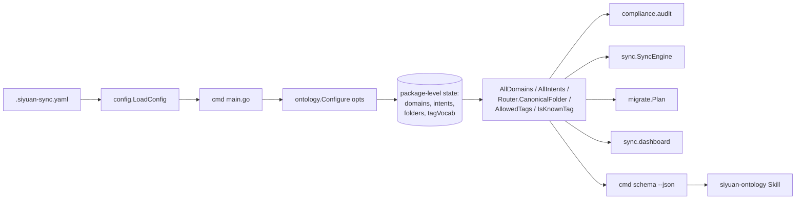
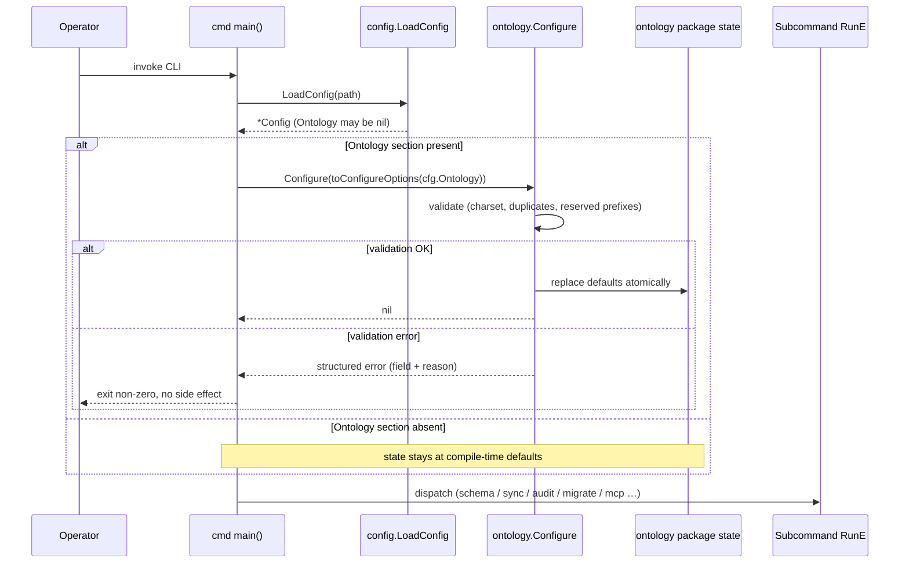
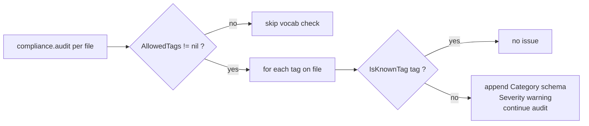

# Design Document — ontology-config

## Overview

The siyuan-knowledge-sync CLI ships a hardcoded bi-modal ontology — six domains, five intents, a `Domain → canonical folder` map — embedded as Go constants in `internal/ontology`. This spec externalizes that schema into an optional `ontology:` section in the existing `.siyuan-sync.yaml` configuration file, so operators can rename a canonical folder, add a domain, or pin a controlled tag vocabulary without touching source code or rebuilding the binary.

The current package-level accessor API (`ontology.AllDomains`, `ontology.AllIntents`, `Router.CanonicalFolder`) stays unchanged. Every downstream consumer (`compliance` audit, `sync` engine, `migrate` plan validator, dashboard generator, `schema --json` subcommand, AI Skill) keeps reading from those same three accessors. What changes underneath is the state they read: the package-level slices and map become initialized-once values that the CLI's `main` populates from the loaded config when an `ontology:` section is present, and otherwise leaves at the compiled-in defaults.

### Goals

- Operator-editable ontology (domains, canonical folders, intents) in a single YAML file.
- Optional controlled tag vocabulary that surfaces non-aborting warnings on unrecognized tags.
- Zero behavior change for existing users with no `ontology:` section (smallest possible upgrade-risk surface).
- `schema --json` reflects the effective ontology so the AI Skill stays config-agnostic.

### Non-Goals

- Multiple ontology profiles per binary (explicit in Req 1 — one effective ontology per process invocation).
- Tooling that translates one user's vocabulary to another's.
- Runtime config reload (re-invoke the CLI to pick up changes).
- Changes to the existing `schema --json` top-level field shape (downstream consumers must keep working).
- Changes to the ontology-gate enforcement semantics (Req 1.x / 2.x from the ontology-gate spec); this spec only changes the *source* of the schema, not the validation behavior on top of it.

## Boundary Commitments

### This Spec Owns

- The YAML shape of the new `ontology:` configuration section.
- The single startup-time `ontology.Configure(opts)` entry point and its validation.
- The package-level state in `internal/ontology` that backs every accessor.
- The `schema --json` output shape additions (`tags.values`, optional).
- The new tag-vocabulary compliance check that emits non-aborting warnings.

### Out of Boundary

- Any consumer's call sites — they keep using the same `AllDomains` / `AllIntents` / `Router.CanonicalFolder` accessors unchanged.
- The ontology-gate enforcement semantics (Req 1.x / 2.x / 8.x from `.kiro/specs/ontology-gate/requirements.md`). What the gate rejects and how it reports it does not change.
- The migration executor and the sync engine flow paths.
- The AI Skill (`.claude/skills/siyuan-ontology/SKILL.md`) — it already reads from `schema --json` and needs no edits.

### Allowed Dependencies

- `gopkg.in/yaml.v3` (already a project dependency; used by `internal/config` and `internal/ontology`).
- `internal/config` may import `internal/ontology` types for the YAML decode targets.
- `cmd/siyuan-knowledge-sync` is the single caller of `ontology.Configure()`.
- `internal/compliance` may add a new check that reads the tag vocabulary via a new accessor on `internal/ontology`.

### Revalidation Triggers

- Adding, renaming, or removing a field on the `ontology:` YAML section → reviews of `internal/config` decode tests, the schema validation tests, and the AI Skill prose.
- Changing the `Configure(opts)` signature → reviews of the `cmd/siyuan-knowledge-sync/main.go` wiring and every test that calls `Configure` for setup.
- Adding a new field to `schema --json` → the AI Skill needs to know whether it can use it.
- Changing the default values (the six domains, five intents, canonical folder map) → every existing test fixture needs review.

## Architecture

### Existing Architecture Analysis

The ontology layer is currently a leaf package: `internal/ontology` imports no other internal package, and every other internal package imports it. The schema constants are package-level slices initialized at compile time; downstream consumers call `AllDomains()` / `AllIntents()` / `Router.CanonicalFolder()` and never see the underlying state. This design extends that pattern: the underlying state stays package-private but becomes mutable through one entry point that the CLI calls once at startup, so consumer code does not change.

### Architecture Pattern & Boundary Map



**Selected pattern**: package-level state mutated by a single startup-time `Configure(opts)` call. The mutation happens in `main()` before any subcommand `RunE` runs and before any goroutine is created. After that point the state is effectively immutable for the rest of the process.

**Why not dependency injection**: turning the schema into an injected `Schema` struct would touch every consumer's signature for no observable benefit. The package-level accessor pattern is already in place and works.

**Steering compliance**: leaf package stays leaf-y. Validation lives at the boundary (`Configure`) where errors can be reported cleanly. The schema is loaded once per process; downstream consumers stay stateless about config.

### Technology Stack

| Layer | Choice | Role | Notes |
|---|---|---|---|
| CLI | Go (existing) | New `Configure(opts)` entry point + new `OntologyConfig` decode target | No new compile-time deps |
| Configuration | `gopkg.in/yaml.v3` (existing) | Extend `Config` struct with optional `Ontology *OntologyConfig` field | Reuses the existing config loader |
| Validation | Pure Go | Charset + duplicate + reserved-prefix checks executed inside `Configure(opts)` | Errors before any side effect |
| Schema JSON | `encoding/json` (existing) | Existing `schemaDoc` gains an optional `Tags *schemaTagsDoc` field | Preserves existing top-level shape |

## File Structure Plan

### New files

```
internal/ontology/
├── configure.go            # Configure(opts) entry point + ConfigureOptions
│                           # + validation (charset, duplicates, reserved
│                           # prefixes); resetToDefaultsForTest() helper
└── configure_test.go       # Validation + idempotency + reset tests

internal/compliance/
└── audit_tag_vocab_test.go # New tag-vocabulary check tests; lives next
                            # to the existing audit_test.go
```

### Modified files

- `internal/config/config.go` — add `Ontology *OntologyConfig` field; expose `OntologyConfig`, `OntologyDomain`, `OntologyIntent` decode-target types.
- `internal/config/config_test.go` — YAML decode tests for the new section, including the "absent" case.
- `internal/ontology/schema.go` — convert `allDomainsCanonical` and `allIntentsCanonical` from `var` constants to package-private mutable storage seeded at package init from compile-time `defaultDomains` / `defaultIntents` slices; add `AllowedTags()` and `IsKnownTag(tag)` accessors backed by package-private state.
- `internal/ontology/router.go` — convert `canonicalFolders` from a fixed `var` map to package-private mutable storage seeded at package init from a compile-time `defaultCanonicalFolders` map.
- `internal/compliance/audit.go` — add a tag-vocabulary check that runs only when `ontology.AllowedTags() != nil`; emits one `Category: "schema"` issue per unrecognized tag with `Severity: "warning"` (non-aborting).
- `cmd/siyuan-knowledge-sync/main.go` — after `LoadConfig` returns, if `cfg.Ontology != nil` call `ontology.Configure(toConfigureOptions(cfg.Ontology))`; on error, exit non-zero before any subcommand runs.
- `cmd/siyuan-knowledge-sync/schema.go` — extend `schemaDoc` with an optional `Tags *schemaTagsDoc` field; populate from `ontology.AllowedTags()` when non-nil; omit otherwise.

### Default values

`internal/ontology/configure.go` exports compile-time `defaultDomains` (`devops`, `forensics`, `security`, `ai-ml`, `software-dev`, `quant-finance`), `defaultIntents` (`config`, `sop`, `log`, `decision`, `concept`), and `defaultCanonicalFolders` (`devops → "Linux & DevOps"`, …). These are the source of truth for "no config section" behavior; tests and production paths reuse them through `Configure(defaults)` / `resetToDefaultsForTest()`.

## System Flows

### Startup with custom ontology



### Tag-vocabulary warning during audit



The audit pipeline continues for every other rule; the warning never aborts the file's sync.

## Requirements Traceability

| Req | Summary | Components | Interfaces | Flows |
|---|---|---|---|---|
| 1.1 | Optional `ontology:` section accepted | `internal/config/Config.Ontology` | `LoadConfig` decode | Startup |
| 1.2 | Absent section → compiled-in defaults | Package init in `ontology/schema.go` + `router.go` | n/a — no `Configure` call | Startup |
| 1.3 | Invalid section → refuse to start | `Configure(opts)` validation | `Configure(opts) error` | Startup |
| 1.4 | Load exactly once | `cmd/main.go` calls `Configure` once | `Configure(opts)` | Startup |
| 2.1 | Domain pair shape | `ConfigureOptions.Domains []ConfigureDomain` | `Configure(opts)` | Startup |
| 2.2 | Duplicate domain id rejected | `validateDomains` | `Configure(opts) error` | Startup |
| 2.3 | Duplicate domain folder rejected | `validateDomains` | `Configure(opts) error` | Startup |
| 2.4 | Reserved-prefix folder rejected | `validateDomains` | `Configure(opts) error` | Startup |
| 2.5 | Configured order preserved | `Configure` keeps input slice order | `AllDomains()` returns in that order | Schema emission |
| 3.1 | Intent id charset | `ConfigureOptions.Intents []ConfigureIntent` | `Configure(opts)` | Startup |
| 3.2 | Duplicate intent id rejected | `validateIntents` | `Configure(opts) error` | Startup |
| 3.3 | Configured order preserved | `Configure` keeps input slice order | `AllIntents()` returns in that order | Schema emission |
| 4.1 | Tag vocabulary accepted | `ConfigureOptions.Tags []string` | `Configure(opts)` | Startup |
| 4.2 | Unrecognized tag → non-aborting warning | new `compliance.audit_tag_vocab` check | `AllowedTags()`, `IsKnownTag(tag)` | Audit / sync per file |
| 4.3 | No vocab → open vocabulary | nil-vs-non-nil discriminator | `AllowedTags()` returns nil | Audit / sync per file |
| 4.4 | Duplicate tag rejected | `validateTags` | `Configure(opts) error` | Startup |
| 5.1 | `schema --json` reflects effective values | `buildSchemaDoc()` (existing) | `schemaDoc` JSON | Schema emission |
| 5.2 | `tags.values` field when configured | new `schemaTagsDoc` | `schemaDoc.Tags *schemaTagsDoc` | Schema emission |
| 5.3 | Existing top-level shape preserved | no removed / renamed JSON fields | `schemaDoc` JSON | Schema emission |
| 6.1 | Default path identical to current | seeded package state matches current constants | `AllDomains()`, `AllIntents()`, `Router.CanonicalFolder()` | Startup |
| 6.2 | Existing tests pass on default path | tests not on the configure path see no change | n/a | Test runs |
| 7.1 | One effective ontology | package-level state | every consumer reads the same accessors | Steady state |
| 7.2 | Both consumers see same values | single mutation point | `Configure(opts)` | Startup |
| 7.3 | No re-read after initial load | `main.go` calls `Configure` once | n/a | Steady state |

## Components and Interfaces

### `internal/ontology` — Configure (new)

| Field | Detail |
|---|---|
| Intent | Public startup-time entry point that validates the operator-supplied ontology and replaces the package-level state. |
| Requirements | 1.3, 1.4, 2.1–2.5, 3.1–3.3, 4.1, 4.3, 4.4, 7.1, 7.2, 7.3 |

**Responsibilities & Constraints**
- Validate every field of `ConfigureOptions` (charset, duplicates, reserved prefixes) before mutating any state.
- On error: return a descriptive error and leave the package-level state untouched.
- On success: replace the package-level domain slice, intent slice, canonical folder map, and tag vocabulary atomically (sequenced inside the function so partial mutation is impossible).
- Preserve the iteration order of the input slices in every downstream accessor.

**Service Interface**
```go
package ontology

// ConfigureDomain pairs a domain id with its canonical folder.
type ConfigureDomain struct {
    ID     string
    Folder string
}

// ConfigureIntent carries a single intent identifier.
type ConfigureIntent struct {
    ID string
}

// ConfigureOptions is the validated input to Configure. Domains and Intents
// are required; Tags is optional (nil = open vocabulary).
type ConfigureOptions struct {
    Domains []ConfigureDomain
    Intents []ConfigureIntent
    Tags    []string
}

// Configure replaces the package-level ontology state with opts. It must
// be called at most once per process invocation, before any goroutine
// reads the ontology accessors. It validates opts fully and returns a
// non-nil error if any field is invalid; on error, the package-level
// state is unchanged.
func Configure(opts ConfigureOptions) error
```
- Preconditions: caller is the CLI's `main` function, called before any subcommand `RunE` runs and before any goroutine is spawned.
- Postconditions: on nil return, every accessor (`AllDomains`, `AllIntents`, `Router.CanonicalFolder`, `AllowedTags`, `IsKnownTag`) reflects the supplied values; on non-nil return, every accessor reflects the previously-active values (compile-time defaults if `Configure` had not run before).
- Invariants: package-level state is mutated by `Configure` and `resetToDefaultsForTest` only; never read concurrently with mutation in production.

**Implementation Notes**
- Validation collects every issue and returns a wrapping error (e.g. `errors.Join`) so an operator sees every problem at once.
- The default state is seeded at package init from compile-time `defaultDomains`, `defaultIntents`, `defaultCanonicalFolders` slices/maps. `Configure` never sees a nil pointer for those.

### `internal/ontology` — tag-vocabulary accessors (new)

| Field | Detail |
|---|---|
| Intent | Surface the optional controlled tag vocabulary to consumers without exposing the package state. |
| Requirements | 4.1, 4.2, 4.3 |

**Service Interface**
```go
package ontology

// AllowedTags returns a fresh copy of the configured tag vocabulary, or
// nil when no vocabulary has been configured (open-vocabulary mode).
// A non-nil empty slice is distinct from nil: it indicates an explicit
// empty vocabulary configured by the operator and rejects every tag.
func AllowedTags() []string

// IsKnownTag reports whether tag is accepted under the configured
// vocabulary. When AllowedTags() returns nil, IsKnownTag returns true
// for every value (open-vocabulary mode).
func IsKnownTag(tag string) bool
```
- Postconditions: `IsKnownTag(t)` is consistent with `AllowedTags()` for every `t`.

### `internal/config` — `OntologyConfig` decode target (new)

| Field | Detail |
|---|---|
| Intent | YAML decode target for the optional `ontology:` section. |
| Requirements | 1.1, 1.2 |

**Service Interface**
```go
package config

// OntologyConfig is the decode target for the optional `ontology:` section
// of .siyuan-sync.yaml. A nil pointer on Config.Ontology means the
// section was absent and the CLI must use compiled-in defaults.
type OntologyConfig struct {
    Domains []OntologyDomain `yaml:"domains"`
    Intents []OntologyIntent `yaml:"intents"`
    Tags    []string         `yaml:"tags,omitempty"`
}

type OntologyDomain struct {
    ID     string `yaml:"id"`
    Folder string `yaml:"folder"`
}

type OntologyIntent struct {
    ID string `yaml:"id"`
}
```

**Implementation Notes**
- `LoadConfig` does not validate the ontology section itself; that is `ontology.Configure(opts)`'s responsibility, called from `main.go`.
- `cmd/main.go` is the only translator between `config.OntologyConfig` and `ontology.ConfigureOptions`.

### `internal/compliance` — tag-vocabulary check (new)

| Field | Detail |
|---|---|
| Intent | Emit a non-aborting warning for every file carrying a tag outside the configured vocabulary. |
| Requirements | 4.2, 4.3 |

**Responsibilities & Constraints**
- The check fires only when `ontology.AllowedTags() != nil`.
- One issue per unrecognized tag per file (`Category: "schema"`, `Severity: "warning"`).
- The check never aborts the file's sync or other compliance rules.

### `cmd/siyuan-knowledge-sync/schema.go` — `tags.values` extension

| Field | Detail |
|---|---|
| Intent | Surface the configured tag vocabulary via `schema --json`. |
| Requirements | 5.1, 5.2, 5.3 |

**Contracts**: JSON output.

**Service Interface**
```go
type schemaTagsDoc struct {
    Values []string `json:"values"`
}

// schemaDoc gains:
//   Tags *schemaTagsDoc `json:"tags,omitempty"`
```
- `buildSchemaDoc()` populates `Tags` only when `ontology.AllowedTags() != nil`.
- The `omitempty` tag means the existing JSON shape stays byte-identical for users with no configured vocabulary, satisfying Requirement 5.3.

### `cmd/siyuan-knowledge-sync/main.go` — Configure wiring

| Field | Detail |
|---|---|
| Intent | Translate `config.OntologyConfig` to `ontology.ConfigureOptions` once at startup. |
| Requirements | 1.3, 1.4, 7.1, 7.2, 7.3 |

**Responsibilities & Constraints**
- After `LoadConfig` returns, before any subcommand `RunE` runs: if `cfg.Ontology != nil`, build a `ConfigureOptions` and call `ontology.Configure`.
- On error: exit non-zero immediately, before any side effect, with the structured error printed to stderr.
- This is the *only* call to `ontology.Configure` in production code (tests may call it for setup + reset).

## Data Models

### Effective ontology data shape

```yaml
# .siyuan-sync.yaml — the new optional section
ontology:
  domains:
    - id: devops
      folder: "Linux & DevOps"
    - id: forensics
      folder: "Digital Forensics"
    # …
  intents:
    - id: config
    - id: sop
    # …
  tags: # optional; when omitted, open vocabulary stays in effect
    - claude
    - mcp
    - python
    # …
```

The full default schema (six domains, five intents) lives in compile-time slices in `internal/ontology/configure.go`. The YAML literal above is illustrative: the actual file shape is whatever the operator writes.

### Validation rules

| Rule | Reject when | Requirement |
|---|---|---|
| Domain id charset | doesn't match `^[a-z][a-z0-9-]*$` | 2.1 |
| Domain folder presence | empty string | 2.1 |
| Domain folder prefix | starts with `/` or `_` | 2.4 |
| Domain id uniqueness | any two domains share an `id` | 2.2 |
| Domain folder uniqueness | any two domains share a `folder` | 2.3 |
| Intent id charset | doesn't match `^[a-z][a-z0-9-]*$` | 3.1 |
| Intent id uniqueness | any two intents share an `id` | 3.2 |
| Tag uniqueness | any two tags share the same value | 4.4 |

All rules are checked in `Configure(opts)`. On any failure the package-level state is *not* mutated; the error wraps every issue (via `errors.Join`) so one run surfaces every problem.

## Error Handling

### Error strategy

`Configure(opts)` is the single point where ontology errors can occur after startup. Every check is value-bound (no I/O), so the only error class is "configuration violates a validation rule". Errors are wrapped with `errors.Join` so an operator sees every issue per run.

### Error categories

| Surface | Class | Behavior |
|---|---|---|
| `Configure(opts)` error | invalid ontology section | CLI exits non-zero before any subcommand runs (no SiYuan call, no git mutation) |
| compliance tag-vocab warning | unrecognized tag in a file's frontmatter or inline tags | one `Category: "schema"`, `Severity: "warning"` issue per file × tag; never aborts the file's sync |

## Testing Strategy

### Unit tests (`internal/ontology/configure_test.go`)
- `TestConfigure_Defaults_PreservedOnNilOpts` — exercising the no-op default path (Req 1.2, 6.1).
- `TestConfigure_RejectsDuplicateDomainID` — two domains share `id` (Req 2.2).
- `TestConfigure_RejectsDuplicateDomainFolder` — two domains share `folder` (Req 2.3).
- `TestConfigure_RejectsReservedFolderPrefix` — folders starting with `_` or `/` (Req 2.4).
- `TestConfigure_RejectsInvalidIDCharset` — invalid characters in domain / intent / tag ids (Req 2.1, 3.1).
- `TestConfigure_PreservesInputOrder` — `AllDomains`, `AllIntents` reflect the input slice order (Req 2.5, 3.3).
- `TestConfigure_TagVocab_NilVsEmpty` — nil = open vocabulary; empty slice = closed empty (Req 4.1, 4.3).
- `TestConfigure_IsIdempotentAndResettable` — call sequence supports test isolation.

### Unit tests (`internal/config/config_test.go`)
- `TestLoadConfig_OntologySectionAbsent_FieldNil` — base case for Req 1.2.
- `TestLoadConfig_OntologySectionPresent_DecodedShape` — happy-path decode for Req 1.1.

### Integration tests (`internal/compliance/audit_tag_vocab_test.go`)
- `TestAudit_TagVocab_EmitsWarningPerUnknownTag` — Req 4.2.
- `TestAudit_TagVocab_SkippedWhenVocabNil` — Req 4.3.
- `TestAudit_TagVocab_NeverAbortsFile` — file proceeds through every other compliance rule.

### Integration tests (`cmd/siyuan-knowledge-sync/main_test.go`)
- `TestMain_ConfigureCalled_WhenOntologySectionPresent` — wires `cfg.Ontology` through to `Configure`.
- `TestMain_ExitsNonZero_OnInvalidOntologyConfig` — invalid section → non-zero exit, no side effects.
- `TestMain_NoConfigureCall_WhenOntologySectionAbsent` — default path stays untouched.

### Schema output tests (`cmd/siyuan-knowledge-sync/schema_test.go`)
- `TestSchemaJSON_TagsField_OmittedWhenVocabNil` — Req 5.3 (no top-level shape change for default users).
- `TestSchemaJSON_TagsField_PresentWhenVocabConfigured` — Req 5.2.
- `TestSchemaJSON_ReflectsConfiguredDomains` — Req 5.1 after a `Configure(opts)` call.

### End-to-end (`e2e/siyuan_e2e_test.go`)
- One new e2e fixture configures a non-default ontology (e.g., adds a `personal` domain → `Personal` folder) and verifies an `.md` file declaring `domain: personal` lands in the `Personal` SiYuan notebook with `custom-domain: personal` attribute. Default-config e2e fixtures stay unchanged (Req 6.2).
