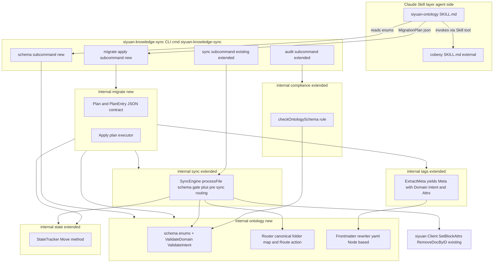
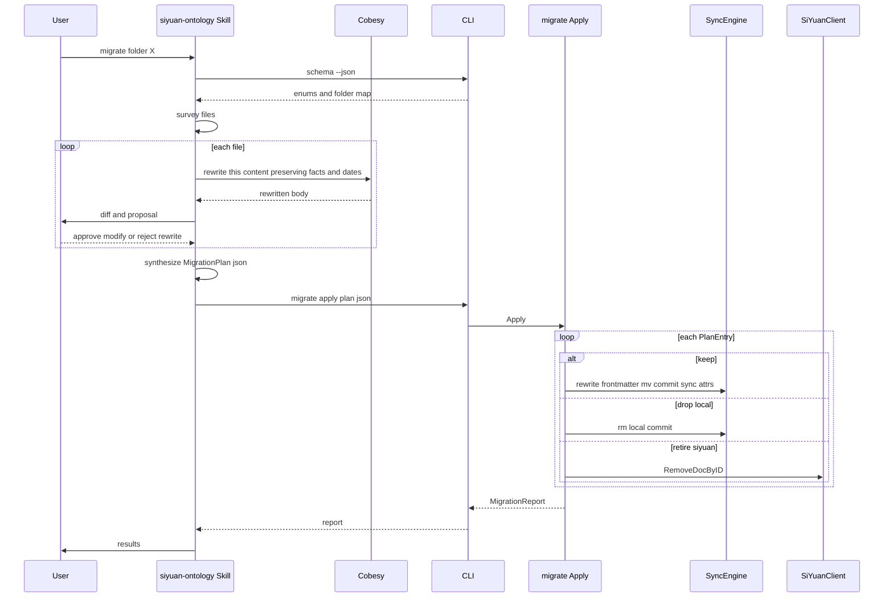

# Design Document

## Overview

**Purpose**: `ontology-gate` is the deterministic schema, validation gate, and routing layer that fronts `siyuan-knowledge-sync`. It enforces a closed-enum bi-modal frontmatter ontology (`domain:` + `intent:`), refuses non-conforming writes with structured per-file errors, deterministically routes files into a canonical folder tree based on the declared domain, and pushes the validated ontology to SiYuan as queryable block attributes.

**Users**: The user (knowledge owner) and AI agents that author wiki-destined markdown. The AI Skill (`siyuan-ontology`) primes agents to author conformant frontmatter on the first try; the CLI gate refuses everything that drifts.

**Impact**: Extends `siyuan-knowledge-sync` (v0.2.0). Adds a new internal package (`internal/ontology`), a migration package (`internal/migrate`), two new Cobra subcommands (`migrate`, `schema`), one project-local Claude Skill (`.claude/skills/siyuan-ontology/`), and extensions in `tags`, `compliance`, `sync`, `state`, `types`. Does not modify Reqs 1–13 of the parent spec.

### Goals
- Closed-enum schema (`domain` ∈ 6 values incl. reserved-empty `quant-finance`; `intent` ∈ 5 values), hardcoded and shared between Go and the Skill via a single source-of-truth subcommand (`schema --json`).
- A CLI gate that refuses writes with a structured `SchemaViolation` containing the offending key, offending value, and allowed values — usable verbatim by an agent to self-correct.
- Frontmatter-wins routing: when `domain:` and the local path disagree, the CLI `git mv`s the file to the canonical folder, commits the rename, and only then syncs. State-tracker is updated atomically with the rename.
- Folder-by-folder interactive migration of two legacy sources through a Hybrid architecture: the Skill produces a `MigrationPlan` (per-file decisions, rewritten body, frontmatter patch), the CLI applies it deterministically. Cobesy runs in the Skill.
- Original temporal frontmatter is carried through migration verbatim via a `yaml.Node`-based rewriter that touches only the two new keys.

### Non-Goals
- New SiYuan API endpoints; the existing client + Req 13 wiring is reused.
- A SiYuan-internal slash command / template artifact (deferred unless explicitly reopened).
- Physical migration of pictures/attachments (this spec flags but does not relocate assets).
- Free-text taxonomies, SHACL, OWL, or any open ontology extension mechanism.
- Replacing `siyuan-knowledge-sync` autonomous `prune` (it still operates for Req 6 of the parent spec); explicit per-file retire here is a *separate* pathway.

## Boundary Commitments

### This Spec Owns
- The two closed enums (`Domain`, `Intent`) and the canonical-folder map.
- Schema validation: detection of missing required keys, out-of-enum values, multi-value `domain:`/`intent:`.
- The structured `SchemaViolation` issue type.
- The pre-sync **abort-this-file** semantics when a schema violation exists (distinct from the existing non-fatal compliance warnings).
- The frontmatter-wins router: `git mv` of the local file to the canonical folder + recording git commit + updating `StateTracker` to the new path before sync.
- Asset-reference move-impact warnings (relative refs that would break after the move).
- The `yaml.Node`-based frontmatter rewriter that adds `domain:`/`intent:` while leaving every other key (especially temporal: `date:`, `lastmod:`, …) verbatim.
- The `MigrationPlan` JSON contract (versioned, atomic-per-entry).
- The `migrate apply <plan.json>` and `schema [--json]` Cobra subcommands.
- The project-local `.claude/skills/siyuan-ontology/` Skill artifact.
- The explicit, per-file approved legacy-SiYuan retire pathway (carried in the `MigrationPlan`).

### Out of Boundary
- Cobesy itself (a foreign Claude Skill at `/Users/mc/.claude/skills/cobesy/`); we invoke it, we do not modify it.
- The interactive plan-generation loop, the cobesy rewrite, and the user diff-approval UX — those live in the Skill, not in Go code.
- The autonomous `prune` (siyuan-knowledge-sync Req 6) — it remains operational, but the explicit retire path here is its own thing.
- Physical asset migration. We scan and warn; we never relocate `assets/foo.png`.
- The existing `siyuan-knowledge-sync` Reqs 1–13 behaviors. We extend them; we do not rewrite them.
- Any SiYuan server change, plugin, or hosting concern.

### Allowed Dependencies
- `gopkg.in/yaml.v3` — already in `go.mod`. Used via the `yaml.Node` API for the lossless frontmatter rewriter.
- `os/exec` `git mv` / `git commit` — already used in test fixtures. Production code uses it here for the rename + commit pair. Avoids a worktree mutation through `go-git` (which is read-only in current production code).
- `encoding/json` (stdlib) — for the `MigrationPlan` contract.
- The existing `siyuan-knowledge-sync` Go packages: `tags`, `compliance`, `sync`, `state`, `siyuan` client, `types`.
- The Claude `Skill` tool — used by the `siyuan-ontology` skill to invoke cobesy.
- No new external Go dependencies are introduced.

### Revalidation Triggers
- Change to either closed enum (add/remove a domain or intent value).
- Change to the canonical-folder map (any folder rename).
- Change to the `MigrationPlan` JSON contract shape or version.
- Change to `Meta.Domain` / `Meta.Intent` exported field shape on `tags.ExtractMeta`.
- Change to `SchemaViolation` issue structure (consumers: the CLI gate, the SKILL.md's self-correction loop, the agent).
- Removal of the assumption that the working tree is a git repo.

## Architecture

### Architecture Pattern & Boundary Map



**Architecture Integration**
- **Selected pattern**: Hybrid (research.md Option B). The Go CLI owns deterministic, testable mechanics; the Claude Skill owns the cognitive workflow. The seam is a versioned JSON plan.
- **Dependency direction** (preserved from `siyuan-knowledge-sync`): `Types → Config → Git/SiYuan Client → Sync Engine → CLI`, with the new layers slotting in as `Types → Ontology (Content) → Compliance + Sync (Core) → Migrate (Core) → CLI (Interface)`. The Skill sits *outside* Go; it consumes the CLI like any agent.
- **Single source of truth for enums**: hardcoded in `internal/ontology/schema.go`. Exposed to the Skill via `siyuan-knowledge-sync schema --json` — the SKILL.md instructs the agent to read that subcommand's output, not to hardcode the enums in the skill prose.

### Technology Stack

| Layer | Choice / Version | Role in Feature | Notes |
|-------|------------------|-----------------|-------|
| CLI | Cobra v1.10.2 (existing) | New `migrate` + `schema` subcommands | Existing pattern |
| YAML | `gopkg.in/yaml.v3` v3.0.1 (existing) | `yaml.Node` API for lossless frontmatter rewrite | Preserves unknown keys + order |
| Git mutation | `os/exec` + system `git` | `git mv` + `git commit -m` during routing/migration | Consistent with existing test fixtures; production change |
| Skill orchestration | Claude `Skill` tool | Agent invokes `cobesy` from `siyuan-ontology` | Agent layer only |
| JSON contract | `encoding/json` (stdlib) | `MigrationPlan` round-trip | Versioned schema |

> No new external Go dependencies. The only environmental prerequisite that did not previously apply to production code is `git` on `PATH` (already required by the project's tests).

## File Structure Plan

```
internal/
├── ontology/                          # NEW package, single source of truth
│   ├── schema.go                       # Domain/Intent enums, Validate*, SchemaViolation factory
│   ├── schema_test.go
│   ├── router.go                       # Router: domain → canonical folder; Route(file)
│   ├── router_test.go
│   ├── frontmatter.go                  # yaml.Node-based AddOntology rewriter
│   └── frontmatter_test.go
├── migrate/                           # NEW package
│   ├── plan.go                         # MigrationPlan / PlanEntry types + JSON marshal
│   ├── plan_test.go
│   ├── apply.go                        # Apply(plan, engine, client) → MigrationReport
│   └── apply_test.go
├── tags/                              # MODIFIED
│   ├── extractor.go                    # + Domain, Intent on frontmatterData & Meta; inject custom-domain/-intent
│   └── extractor_test.go
├── compliance/                        # MODIFIED
│   ├── audit.go                        # + checkOntologySchema rule producing schema-category issues
│   └── audit_test.go
├── sync/                              # MODIFIED
│   ├── engine.go                       # processFile: abort on schema violation; pre-sync routing via Router; state.Move
│   └── engine_test.go
├── state/                             # MODIFIED
│   ├── tracker.go                      # + Move(old, new) preserving SiYuanID, NotebookID, SyncedAt
│   └── tracker_test.go
└── types/                             # MODIFIED
    └── types.go                        # + SchemaViolation, MigrationPlan, PlanEntry, MigrationReport, RouteAction

cmd/siyuan-knowledge-sync/             # MODIFIED
├── main.go                             # Register migrate + schema subcommands
├── migrate.go                          # NEW: cobra command `migrate apply <plan.json>`
└── schema.go                           # NEW: cobra command `schema [--json]`

.claude/skills/siyuan-ontology/        # NEW project-local skill
└── SKILL.md                            # Agent orchestrator: enums sourced from `schema --json`,
                                        # plan synthesis, cobesy invocation, diff approval, CLI handoff
```

## System Flows

### Validation gate (existing audit/sync, schema-aware)
```mermaid
sequenceDiagram
    participant CLI
    participant SyncEngine
    participant Compliance
    participant OntologySchema
    participant FrontmatterRewriter
    participant SiYuanClient

    CLI->>SyncEngine: sync
    SyncEngine->>Compliance: Audit file
    Compliance->>OntologySchema: ValidateDomain ValidateIntent
    OntologySchema-->>Compliance: ok or SchemaViolation
    alt SchemaViolation
        Compliance-->>SyncEngine: issues with Category schema
        SyncEngine-->>CLI: abort this file; record structured error; continue batch
    else valid
        SyncEngine->>SyncEngine: Router Route file
        opt path mismatch
            SyncEngine->>SyncEngine: git mv + commit
            SyncEngine->>StateTracker: Move old new
            SyncEngine->>SyncEngine: asset scan; emit warnings if any
        end
        SyncEngine->>SiYuanClient: createDocWithMd or updateBlock with frontmatter stripped body
        SyncEngine->>SiYuanClient: SetBlockAttrs incl custom-domain custom-intent
    end
```

### Migration apply


## Requirements Traceability

| Requirement | Summary | Components | Interfaces | Flows |
|-------------|---------|------------|------------|-------|
| 1.1, 1.2, 1.4 | Required keys + closed enums (`domain`, `intent`) | `ontology/schema`, `tags/extractor` | `ValidateDomain`, `ValidateIntent`, extended `frontmatterData` | Validation gate |
| 1.3 | `quant-finance` reserved-empty | `ontology/schema`, `ontology/router` | Map entry + `.gitkeep` rule | Setup-time |
| 1.5 | Preserve other frontmatter verbatim | `ontology/frontmatter` | `AddOntology` via `yaml.Node` | Migration apply |
| 1.6 | Reject multi-value `domain:`/`intent:` | `ontology/schema` | Validator rejects non-scalar nodes | Validation gate |
| 2.1–2.4 | Gate parses + rejects with structured error | `compliance/audit`, `sync/engine` | `checkOntologySchema`, `SchemaViolation` issue | Validation gate |
| 2.5 | Structured form usable by humans + agents | `types.SchemaViolation` | JSON-marshalable struct | CLI output / Skill |
| 2.6 | Per-file violation does not abort batch | `sync/engine` | `processFile` skip-file pattern | Validation gate |
| 2.7 | Auto-fix never invents ontology fields | `compliance/autofix` | Explicit no-op for schema category | Validation gate |
| 3.1 | Canonical-folder map covers every domain | `ontology/router` | `Router.CanonicalFolder` | Setup-time |
| 3.2, 3.3 | `git mv` + commit when path mismatch | `sync/engine`, `state/tracker` | `Router.Route`, `git mv`, `StateTracker.Move` | Validation gate / migration apply |
| 3.4 | Asset-ref warnings on move | `ontology/router` (asset scan) | `Router.ScanAssetRefs` | Validation gate / migration apply |
| 3.5 | Schema-violating file is not routed | `sync/engine` | Schema-check precedes Route | Validation gate |
| 3.6 | No-op when already canonical | `sync/engine` | `Router.Route` returns `RouteNoop` | Validation gate |
| 4.1, 4.2 | `custom-domain`/`-intent` applied + updated | `tags/extractor`, existing `SetBlockAttrs` | `Meta.Attrs` injection (one place) | Validation gate |
| 4.3 | Non-fatal on attr API error | `sync/engine` (existing Req 13.4) | Inherits existing path | Validation gate |
| 4.4 | MCP can query the attrs | existing MCP server + SiYuan SQL | No new code; documented in SKILL.md | Agent search |
| 5.1–5.4 | `SKILL.md` primer + future-artifact source-of-truth | `.claude/skills/siyuan-ontology/SKILL.md`, `schema --json` | Skill metadata + CLI subcommand | Skill orchestration |
| 6.1–6.6 | Folder-by-folder migration: Skill drives, CLI applies | `siyuan-ontology` SKILL, `migrate/plan` + `migrate/apply`, `cmd migrate.go` | `MigrationPlan` JSON, `migrate apply <plan.json>` | Migration apply |
| 6.7 | Legacy folders without a domain → explicit reassignment | `siyuan-ontology` SKILL (UX), `migrate.PlanEntry.Decision` | `decision: drop | keep` required per file | Migration apply |
| 7.1, 7.2, 7.5 | Cobesy rewrite preserves facts + dates; no-op when no change | `siyuan-ontology` SKILL (agent), `ontology/frontmatter` (rewrite invariant) | Skill prompt + `AddOntology` only touches new keys | Migration apply |
| 7.3, 7.4 | User diff-approval before commit; reject keeps original | `siyuan-ontology` SKILL | Skill UX | Migration apply |
| 8.1–8.4 | Original temporal frontmatter preserved verbatim | `ontology/frontmatter`, test guard | `AddOntology` enforces "only insert the two keys" invariant | Migration apply (test) |
| 8.5 | No synthesis when source lacks dates | `ontology/frontmatter` | `AddOntology` does not add temporal keys | Migration apply |
| 9.1–9.4 | Asset-ref move-impact warnings; never block move | `ontology/router` (`ScanAssetRefs`) | Report list in `MigrationReport.AssetWarnings` | Validation gate / migration apply |
| 10.1, 10.4 | Operate alongside legacy; hpath collision detection | `sync/engine`, `migrate/apply` | Pre-write hpath probe | Validation gate / migration apply |
| 10.2, 10.3 | Per-file retire under explicit approval; never autonomous | `migrate/apply` (`op: retire_siyuan`) | Explicit plan entry only; not folded into `prune` | Migration apply |

## Components and Interfaces

| Component | Domain/Layer | Intent | Req Coverage | Key Dependencies (P0/P1) | Contracts |
|-----------|--------------|--------|--------------|--------------------------|-----------|
| `ontology/schema` | Content | Closed enums + validators + violation factory | 1.1–1.6, 2.1–2.5 | None (P0) | Service |
| `ontology/router` | Content | Canonical-folder map + move decision + asset scan | 1.3, 3.1–3.6, 9.1–9.4 | `ontology/schema` (P0) | Service |
| `ontology/frontmatter` | Content | `yaml.Node`-based ontology insertion preserving all other keys | 1.5, 8.1–8.5 | `yaml.v3` (P0) | Service |
| `migrate/plan` | Core | Versioned JSON plan + entry types | 6.1–6.7, 10.2 | `encoding/json` (P0) | Service, State |
| `migrate/apply` | Core | Per-entry executor coordinating tags + sync + client | 6.4, 7.5, 10.2, 10.4 | All of the above (P0); `siyuan.Client` (P0); `sync.SyncEngine` (P0) | Service |
| `tags/extractor` (ext) | Content | Surface `Domain`/`Intent` on `Meta`; inject custom-attrs | 1.1, 1.4, 4.1, 4.2 | `ontology/schema` (P0), `yaml.v3` (P0) | Service |
| `compliance/audit` (ext) | Core | `checkOntologySchema` rule producing schema-category issues | 2.1–2.7 | `ontology/schema` (P0), `tags/extractor` (P0) | Service |
| `sync/engine` (ext) | Core | Schema-gate abort + pre-sync routing + state move | 2.1, 2.6, 3.2–3.6, 4.1, 10.4 | All above (P0) | Service |
| `state/tracker` (ext) | Data | `Move(old, new)` preserving SiYuanID | 3.2, 3.3 | Filesystem (P0) | Service, State |
| `cmd migrate.go` | Interface | `migrate apply <plan.json>` Cobra subcommand | 6.1–6.6, 10.2 | `migrate/apply` (P0) | Service |
| `cmd schema.go` | Interface | `schema [--json]` Cobra subcommand (source-of-truth for SKILL) | 1.2, 1.4, 3.1, 5.1, 5.3 | `ontology/schema`, `ontology/router` (P0) | Service |
| `siyuan-ontology` SKILL | Interface (agent) | Plan synthesis, cobesy invocation, diff approval, CLI handoff | 5.1–5.4, 6.1–6.7, 7.1–7.4 | `siyuan-knowledge-sync schema --json` (P0), cobesy SKILL.md (P0) | Service (agent-side) |

### Content layer

#### `ontology/schema`

**Contracts**: Service [x]

```go
package ontology

// Closed enum values. Hardcoded; the only allowed sources of truth.
type Domain string
const (
    DevOps        Domain = "devops"
    Forensics     Domain = "forensics"
    Security      Domain = "security"
    AIML          Domain = "ai-ml"
    SoftwareDev   Domain = "software-dev"
    QuantFinance  Domain = "quant-finance" // reserved, initially empty
)

type Intent string
const (
    IntentConfig   Intent = "config"
    IntentSOP      Intent = "sop"
    IntentLog      Intent = "log"
    IntentDecision Intent = "decision"
    IntentConcept  Intent = "concept"
)

// AllDomains / AllIntents are the only sources for emission and validation.
func AllDomains() []Domain
func AllIntents() []Intent

// ValidateDomain / ValidateIntent return (nil) on success or a *SchemaViolation
// with Key, OffendingValue, Allowed populated.
func ValidateDomain(value string) *SchemaViolation
func ValidateIntent(value string) *SchemaViolation

// CheckOntologyFrontmatter parses an ALREADY-extracted Meta (from tags.Meta or
// a yaml.Node) and returns all violations (may include "missing required key",
// "out of enum", "multi-value"). Empty slice on full conformance.
func CheckOntologyFrontmatter(file string, m FrontmatterView) []SchemaViolation

// FrontmatterView is the minimal shape the validator needs.
type FrontmatterView struct {
    DomainNode *yaml.Node // nil if missing
    IntentNode *yaml.Node // nil if missing
}
```

- Preconditions: Caller has already parsed YAML enough to know whether the keys are present and whether they are scalar.
- Postconditions: All violations are surfaced; the validator never raises a panic or returns ambiguous nil-when-invalid.
- Invariants: Enum values are not regenerated at runtime; they are constants. Any expansion is a code change (and a Revalidation Trigger).

#### `ontology/router`

**Contracts**: Service [x]

```go
type Router struct{}

// CanonicalFolder returns the wiki-rooted folder path for a domain.
// Panics on an unknown domain (validation must precede routing).
func (Router) CanonicalFolder(d Domain) string

// Folder map (final names; confirmed with user during this design phase):
//   devops        -> "wiki/Linux & DevOps"
//   forensics     -> "wiki/Digital Forensics"
//   security      -> "wiki/Security"
//   ai-ml         -> "wiki/AI & ML"
//   software-dev  -> "wiki/Software Development"
//   quant-finance -> "wiki/Quant Finance"   (gitkept, empty)

type RouteAction int
const (
    RouteNoop RouteAction = iota
    RouteMove
)

type RouteDecision struct {
    Action       RouteAction
    SourcePath   string
    TargetPath   string // filled when Action == RouteMove
    AssetWarnings []AssetWarning
}

// Route decides whether a file declaring `domain: d` at `localPath` must move.
// If it must, target is `<canonical>/<basename>`. Asset warnings are computed
// from the body irrespective of action and returned for the caller to surface.
func (Router) Route(d Domain, localPath string, body []byte) RouteDecision

type AssetWarning struct {
    Reference  string // raw markdown reference, e.g. "assets/foo.png"
    OldResolved string
    NewResolved string
    TargetExists bool
}
```

- Preconditions: `d` has passed `ValidateDomain`. Body is the original file body (post-frontmatter not required).
- Postconditions: For `RouteMove`, `TargetPath` is the canonical destination; `AssetWarnings` lists each relative reference whose resolved path differs after the move and whether that new path exists.

#### `ontology/frontmatter`

**Contracts**: Service [x]

```go
// AddOntology inserts (or replaces, only if values differ) the two scalar keys
// `domain:` and `intent:` in the YAML frontmatter of `content`, preserving all
// other keys, their values, their declaration order, and (best-effort) their
// surrounding comments.
//
// Invariants (enforced):
//   - No other key's value is mutated. If any other key would be touched,
//     the function returns ErrUnsafeRewrite without writing.
//   - Temporal keys (`date`, `lastmod`, `created`, `updated`, `original_date`)
//     are guaranteed byte-identical pre/post.
//   - If `content` has no frontmatter, AddOntology prepends a fresh frontmatter
//     block containing only `domain:` and `intent:` (no synthesized dates).
func AddOntology(content []byte, d Domain, i Intent) ([]byte, error)

var ErrUnsafeRewrite = errors.New("ontology: rewriter would touch a non-ontology key")
```

- Mechanism: parse via `yaml.Node`, locate the mapping document, insert/replace only the two keys, emit via `yaml.Encoder` configured to preserve scalar quoting style. Where comment preservation is impossible (yaml.v3 limitation around node detach/re-attach), keep the content best-effort and pin the temporal-fields invariant via a post-encode diff guard.
- Pre/post diff guard: after encoding, the rewriter re-parses both inputs into `map[string]yaml.Node` and asserts that every key other than the two ontology keys has byte-identical raw bytes for its value range. If not, return `ErrUnsafeRewrite`.

### Core layer

#### `migrate/plan`

**Contracts**: Service [x], State [x]

```go
type MigrationPlanVersion int
const PlanV1 MigrationPlanVersion = 1

type MigrationPlan struct {
    Version  MigrationPlanVersion `json:"version"`
    Source   string               `json:"source"`    // e.g. "/Users/mc/Source/wiki/Hosting"
    GeneratedAt time.Time         `json:"generated_at"`
    Entries  []PlanEntry          `json:"entries"`
}

type PlanOp string
const (
    OpKeep        PlanOp = "keep"
    OpDropLocal   PlanOp = "drop_local"
    OpRetireSiyuan PlanOp = "retire_siyuan"
)

type PlanEntry struct {
    Op             PlanOp  `json:"op"`
    SourcePath     string  `json:"source_path"`           // absolute or repo-relative
    Domain         Domain  `json:"domain,omitempty"`      // required for OpKeep
    Intent         Intent  `json:"intent,omitempty"`      // required for OpKeep
    RewrittenBody  string  `json:"rewritten_body,omitempty"` // cobesy output for OpKeep
    SiYuanDocID    string  `json:"siyuan_doc_id,omitempty"`  // required for OpRetireSiyuan
    Notes          string  `json:"notes,omitempty"`
}
```

- Atomicity: each entry is its own transaction. Failures are recorded in `MigrationReport.Errors[i]`; subsequent entries still execute. This matches the existing per-file non-fatal pattern in `sync/engine.processFile`.
- Validation: `plan.Validate()` rejects unknown ops, missing required fields per op, unknown versions.

#### `migrate/apply`

```go
func Apply(ctx context.Context, plan MigrationPlan, eng *sync.SyncEngine, client *siyuan.Client) (*types.MigrationReport, error)
```

Per-entry behavior:
- **OpKeep**: `ontology.AddOntology(body, Domain, Intent)` → write file → if `RewrittenBody != ""` overwrite body (post-frontmatter only) → `eng.RouteAndSync(path)` (new method: validates, routes, syncs, applies attrs).
- **OpDropLocal**: `git rm <path>` + commit. State entry removed if present. No SiYuan write.
- **OpRetireSiyuan**: `client.RemoveDocByID(SiYuanDocID)` + state entry removed if matched. Skipped (with explicit error in report) if no SiYuan ID provided or it does not match state.

#### `tags/extractor` (extended)

The single change in `tags.Meta`:
```go
type Meta struct {
    Title  string
    Body   []byte
    Attrs  map[string]string // existing custom-<tag>
    Domain string            // NEW: from frontmatter `domain:` if present
    Intent string            // NEW: from frontmatter `intent:` if present
}
```

`ExtractMeta` adds `domain:` and `intent:` to `Attrs` as `custom-domain` and `custom-intent` (Req 4.1) so the existing `SetBlockAttrs` call in `sync/engine.processFile` continues to do the right thing without modification (Req 13.4 wiring inherited).

#### `compliance/audit` (extended)

New rule:
```go
// checkOntologySchema produces ComplianceIssues with Category == "schema"
// for missing/unknown/multi-value domain/intent. These issues drive the
// abort-this-file behavior in sync/engine.processFile (NOT a non-fatal warning).
func (e *ComplianceEngine) checkOntologySchema(filePath string, fmView FrontmatterView) []types.ComplianceIssue
```

`types.ComplianceIssue` gains a `Category` field (back-compat: empty `Category` means existing legacy issue; `"schema"` is the new gate category).

#### `sync/engine` (extended)

`processFile` is augmented in this order (post-`compliance.AutoFix`):
1. **Schema gate**: if the audit issued any `Category == "schema"` violations, append them to `report.Errors` as structured `SyncError{File, Message: <json-encoded SchemaViolation>}` and **return** (this file is aborted; the batch continues — Req 2.6).
2. **Route**: `router.Route(meta.Domain, tf.Path, meta.Body)`. If `RouteMove`:
   - `git mv` source → target via `os/exec`, then `git commit -m "ontology-route: <old> -> <new>"`.
   - `state.Move(old, new)`.
   - Update `tf.Path` to the new path for the remainder of processing.
   - Surface `AssetWarnings` into the per-file part of the report (warnings, not errors; Req 9.4).
3. **Upload / title / attrs**: existing Req 13 wiring runs against the new path; `custom-domain` / `custom-intent` are now in `meta.Attrs` automatically (Req 4.1, 4.2).

A new exported method on `SyncEngine` for `migrate/apply`:
```go
func (e *SyncEngine) RouteAndSync(ctx context.Context, path string) error
```
which does steps 1–3 for a single file.

#### `state/tracker` (extended)

```go
// Move atomically renames an entry from oldPath to newPath, preserving
// SiYuanID, NotebookID, and SyncedAt. Returns ErrCollision if newPath
// already has an entry that points at a different SiYuanID.
func (t *StateTracker) Move(oldPath, newPath string) error
```

#### `cmd schema.go`

```
$ siyuan-knowledge-sync schema --json
{
  "version": 1,
  "domain": {
    "values": ["devops","forensics","security","ai-ml","software-dev","quant-finance"],
    "folders": {
      "devops":        "wiki/Linux & DevOps",
      "forensics":     "wiki/Digital Forensics",
      "security":      "wiki/Security",
      "ai-ml":         "wiki/AI & ML",
      "software-dev":  "wiki/Software Development",
      "quant-finance": "wiki/Quant Finance"
    }
  },
  "intent": { "values": ["config","sop","log","decision","concept"] },
  "required_keys": ["domain","intent"]
}
```

This is the **single source the Skill consults**. The SKILL.md does not hardcode the enums.

#### `cmd migrate.go`

```
siyuan-knowledge-sync migrate apply <plan.json>
```
- Reads + validates the plan (`plan.Validate()`).
- Loads config (same path resolution as existing subcommands).
- Calls `migrate.Apply(...)`.
- Prints a `MigrationReport` to stderr matching the existing `printSyncReport` style.

### Interface (agent) layer

#### `.claude/skills/siyuan-ontology/SKILL.md`

```yaml
---
name: siyuan-ontology
description: >
  Author wiki-destined markdown that conforms to the ontology-gate schema
  (closed `domain:` + `intent:` enums) and drive folder-by-folder migration
  of legacy notes. Always reads enums from `siyuan-knowledge-sync schema --json`;
  never hardcodes them. Invokes the `cobesy` skill to rewrite content during
  migration; submits a versioned MigrationPlan to `siyuan-knowledge-sync migrate apply`.
---
```

The skill body documents:
- How to fetch the schema (subprocess + parse JSON).
- The frontmatter shape required.
- The structured `SchemaViolation` format and the self-correction loop on rejection.
- The migration workflow: survey → per-file (cobesy rewrite → diff → user approval) → emit plan JSON → invoke `migrate apply`.
- The preservation invariant for original temporal frontmatter — passed into the cobesy invocation as a hard constraint.

## Data Models

### Domain model
```
MigrationPlan 1──*  PlanEntry
PlanEntry      *──1 Domain (closed enum)
PlanEntry      *──1 Intent (closed enum)
WikiFile       1──1 FrontmatterView (domain?, intent?)
WikiFile       *──1 CanonicalFolder (via Domain)
```

### Logical data
- `MigrationPlan` is a single JSON file produced by the Skill and consumed by `migrate apply`. Versioned (`version: 1`). On schema bump, the loader rejects older versions until an explicit migration path is added.
- `SyncState` (`.siyuan-sync-state.json`) is extended only operationally: a move updates the existing entry's key (no schema change to the JSON file).

### Data contracts
- `SchemaViolation`:
  ```json
  {
    "file": "wiki/devops/foo.md",
    "key": "intent",
    "offending_value": "braindump",
    "allowed": ["config","sop","log","decision","concept"]
  }
  ```
  Emitted to stderr (one JSON object per line — agents and humans both parse cleanly).

## Error Handling

| Category | Scenario | Response |
|----------|----------|----------|
| Schema violation | Missing `domain:`/`intent:`, out-of-enum, multi-value | Structured `SchemaViolation` per file; **file aborted**; batch continues. (Req 2.2–2.6) |
| Asset reference would break | Move would invalidate a relative ref | Warning recorded in `MigrationReport.AssetWarnings`; move proceeds (Req 9.4) |
| Frontmatter unsafe rewrite | `ontology.AddOntology` would touch a non-ontology key | `ErrUnsafeRewrite`; the plan entry fails; remaining entries still execute |
| Temporal-field mutation attempt | Rewrite proposes a value differing from source for `date`/`lastmod`/… | Reject and surface as `MigrationReport.Errors[i]` (Req 8.3) |
| `git mv` / `git commit` failure | Shell error during routing | Per-file error; file not synced; batch continues |
| `RemoveDocByID` failure on retire | API error | Per-file error; remaining entries still execute (Req 10.3 — never autonomous) |
| hpath collision | Migrated file targets the hpath of a still-extant legacy SiYuan doc | Pre-write probe → structured error; require explicit `overwrite_existing: true` field in the plan entry (Req 10.4) |
| CF Access / non-JSON | (inherited from siyuan-knowledge-sync Req 12) | Unchanged |

## Testing Strategy

### Unit
- `ontology/schema`: every enum constant validated; `ValidateDomain` / `ValidateIntent` reject empty + unknown + case variants; multi-value detection on non-scalar `yaml.Node` (Req 1.6).
- `ontology/router`: each domain → expected canonical folder; no-op when path already canonical (Req 3.6); move target = canonical + basename for nested + flat sources; `quant-finance` returns its canonical folder even with zero files routed (Req 1.3).
- `ontology/frontmatter` (the critical preservation guard): table-driven cases with mixed key orders, quoted/unquoted scalars, comments, anchors; assert exact byte preservation of `date:`/`lastmod:`/custom keys (Req 1.5, 8.1–8.5); `ErrUnsafeRewrite` fires on synthetic regression that touches a non-ontology key.
- `migrate/plan`: round-trip JSON; reject unknown version; reject missing required fields per op.
- `tags/extractor`: `Meta.Domain`/`Meta.Intent` populated; `Meta.Attrs` includes `custom-domain` / `custom-intent`; existing `Extract` behavior unchanged (drift-proofed via the existing 7.3 drift-guard test).
- `compliance/audit`: `checkOntologySchema` produces `Category == "schema"` issues for each violation class; pre-existing audit categories unchanged.
- `state/tracker`: `Move` preserves SiYuanID + NotebookID + SyncedAt; `Move` returns `ErrCollision` on a target collision with a different SiYuanID; round-trip save/load over a Move.

### Integration
- `sync/engine`: a file with valid ontology under a wrong path → engine moves it (`git mv` + commit), state updates, sync proceeds, `custom-domain`/`custom-intent` arrive in SiYuan (mock).
- `sync/engine`: a file with an out-of-enum `intent:` → engine emits structured `SchemaViolation`; file is NOT routed, NOT uploaded; other valid files in the same batch still complete.
- `sync/engine`: a file whose `domain:` is valid but whose path already matches the canonical folder → no `git mv`, no extra commit.
- `migrate/apply`: a plan with mixed ops (keep+drop+retire) executes each entry; failure on one does not block the rest; `MigrationReport.AssetWarnings` aggregates router warnings.
- `cmd schema --json`: output JSON deserialises into the same Go types the validator uses (proves source-of-truth alignment).

### E2E (against the existing containerized SiYuan harness)
- A valid `domain:` + `intent:` file uploaded → SiYuan document has `custom-domain` and `custom-intent` (verified via `getBlockAttrs`).
- A file moved by routing (frontmatter wins) → exported back from SiYuan reflects the new hpath.
- A retire entry in a plan → the targeted SiYuan doc is gone after `migrate apply`; nothing else is touched.

## Security Considerations
- The schema gate refuses to push *any* non-conforming write to SiYuan; agents cannot escape the closed enum even by misinterpreting the SKILL.md.
- The `MigrationPlan` is treated as user-trusted input (it is produced by the Skill the user controls); however, paths inside the plan are validated to stay under the repo root before any `git mv` / `git rm` runs (no symlink escape, no `../../etc/passwd`).
- `os/exec git` invocations pass paths as explicit arguments, never via shell interpolation.
- The `siyuan-ontology` SKILL must not embed any credentials. The CLI continues to read CF Access service-token and SiYuan token only from the user's gitignored `.siyuan-sync.yaml` (existing security posture; Req 12.5 of `siyuan-knowledge-sync` still applies).
- The Skill's `schema --json` invocation runs the local CLI binary — no network reach; no third-party download in the hot path.

## Open Questions / Risks (to revisit at task time)
- Comment preservation in `ontology/frontmatter`: yaml.v3's `Node` API loses some comment forms on re-encode. Stretch goal: preserve. Bare minimum: temporal keys' byte-identity is non-negotiable.
- `quant-finance` empty folder: ship a `.gitkeep` so the folder exists in the tree from day one. Initial proposal in this design; confirm at task time.
- Single source-of-truth via `schema --json`: the SKILL.md instructs the agent to call it on every session. If the agent has cached output from a previous version, drift can sneak in. Mitigation: bake a `version` field into the JSON output; the Skill checks it and re-fetches on mismatch.
