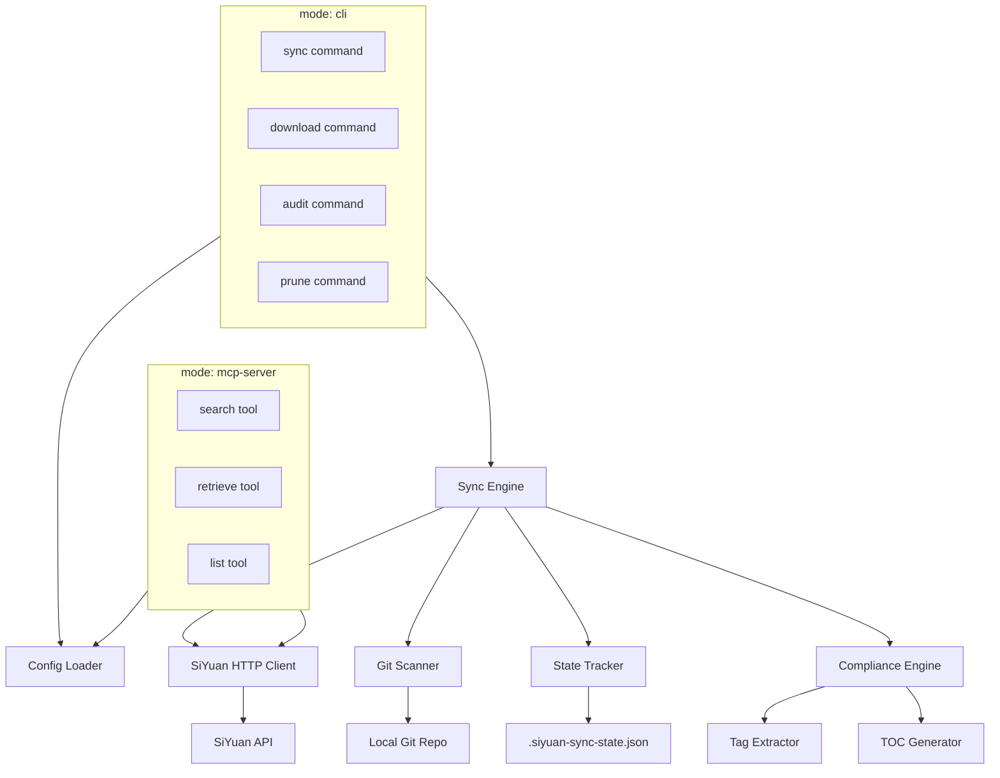
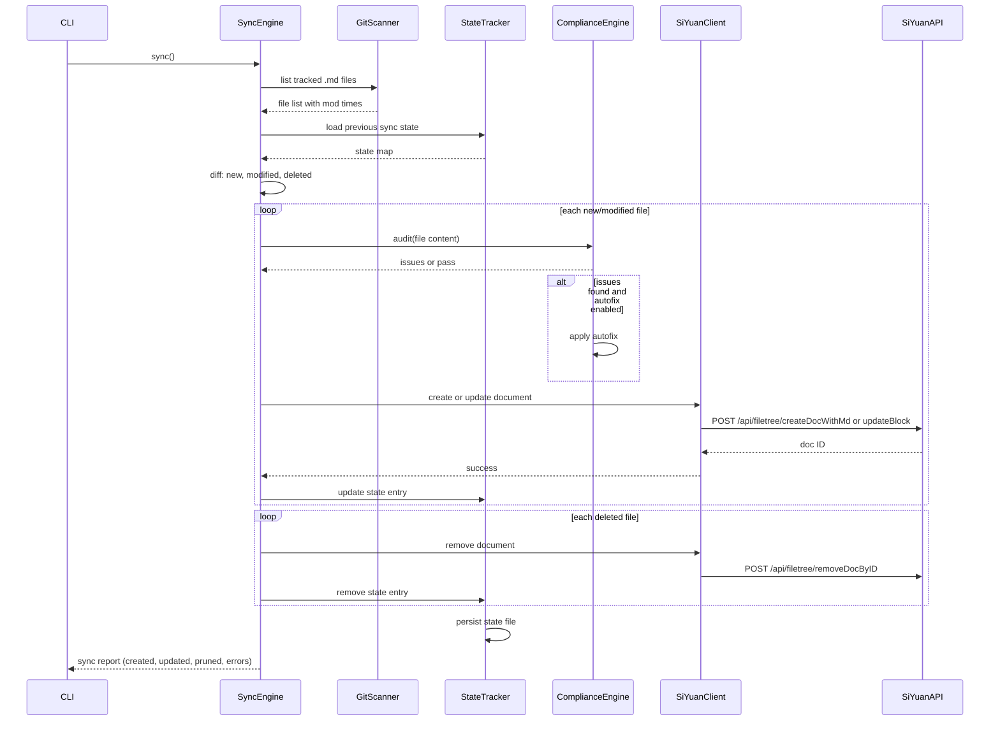
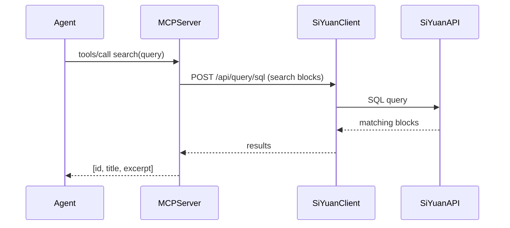

# Design Document

## Overview

**Purpose**: SiYuan Knowledge Sync delivers bidirectional synchronization of git-tracked markdown notes with a SiYuan notebook server to users who maintain their knowledge base in version-controlled markdown while using SiYuan as their note-taking frontend.

**Users**: Individual knowledge workers who use SiYuan as their primary note-taking tool and want their notes version-controlled in git. AI agents access the synced knowledge base through an MCP server for search and retrieval.

**Impact**: A greenfield Go CLI tool and MCP server. No existing codebase to modify.

### Goals
- Bidirectional sync between git-tracked `.md` files and SiYuan documents
- SiYuan compliance auditing with automatic fixes for common issues
- MCP server for AI agent search and retrieval of SiYuan content
- Folder-to-notebook mapping preserving directory hierarchy
- Tag extraction, TOC generation, and pruning of deleted files

### Non-Goals
- Real-time sync (this is batch-oriented)
- Multi-user or collaborative editing
- Non-markdown file sync
- Web UI or desktop application
- Sync platforms other than SiYuan

## Boundary Commitments

### This Spec Owns
- Git-tracked `.md` file discovery and filtering
- HTTP communication with SiYuan API (notebooks, documents, blocks, attributes, export)
- Markdown compliance checking and auto-fix against SiYuan formatting rules
- Bidirectional content transfer: local files → SiYuan documents and vice versa
- Deletion propagation (pruning): local deletions → remote document removal
- Tag extraction from markdown frontmatter/inline syntax → SiYuan block attributes
- TOC generation from heading structure
- MCP server exposing search, retrieval, and listing tools to AI agents
- Persistent sync state mapping local file paths to SiYuan document IDs
- CLI interface for user operations (sync, download, audit, prune)
- Configuration: SiYuan endpoint URL and authentication token

### Out of Boundary
- Git operations (this spec reads git metadata; it does not commit, push, or manage branches)
- SiYuan server hosting or administration
- Real-time file watching (batch-only; watch mode deferred)
- SiYuan plugin/skill implementation (the skill is a SiYuan-side artifact; this spec handles sync from it)
- Markdown rendering or editing
- File-based asset upload (assets references audited but not uploaded)

### Allowed Dependencies
- **go-git** (v5): Read-only access to git repository metadata for file tracking
- **SiYuan HTTP API** (v3.x+): Notebooks, documents, blocks, export, attributes, SQL endpoints
- **MCP Go SDK** (v1.x): MCP server transport and tool registration
- **Cobra**: CLI command structure
- **Goldmark**: Markdown parsing for compliance audit and structure analysis
- **yaml.v3**: Configuration file and frontmatter parsing
- **Local filesystem**: Read/write markdown files, state file persistence

### Revalidation Triggers
- SiYuan API contract changes (endpoint paths, request/response schemas, auth format)
- MCP protocol version bumps requiring SDK migration
- Sync state file schema changes (breaking format changes)
- Config file schema changes
- Dependency removal or replacement of go-git, goldmark, or the MCP SDK

## Architecture

### Architecture Pattern & Boundary Map



**Architecture Integration**:
- **Selected pattern**: Layered CLI with shared core. CLI and MCP server are two entry points sharing the same SiYuan client, config, and sync engine.
- **Dependency direction**: Config → Types → Git/SiYuan Client → Sync Engine → CLI/MCP Server
- **Domain boundaries**: Sync engine owns coordination; compliance engine owns content transformation; MCP server is read-only frontend to SiYuan data; CLI is user-facing operational frontend.

### Technology Stack

| Layer | Choice / Version | Role in Feature | Notes |
|-------|------------------|-----------------|-------|
| CLI | Cobra v1.x | Command structure (sync, download, audit, prune) | Industry standard Go CLI |
| HTTP Client | net/http (stdlib) | SiYuan API communication | Thin JSON POST client, no framework needed |
| Git Integration | go-git v5.x | Git-tracked file discovery, change detection | Pure Go, no git binary dependency |
| MCP Server | modelcontextprotocol/go-sdk v1.x | MCP transport and tool registration | Official SDK, typed tool handlers |
| Markdown Parsing | goldmark v1.x | Compliance audit, heading extraction, frontmatter | Extensible, CommonMark compliant |
| Config Parsing | yaml.v3 | `.siyuan-sync.yaml` config and markdown frontmatter | Standard library choice |
| Data Storage | JSON file (stdlib) | Sync state tracking (.siyuan-sync-state.json) | Simple persistence, no DB needed |

## File Structure Plan

```
cmd/siyuan-knowledge-sync/
└── main.go                       # Entry point: cobra root + "mcp-server" subcommand
internal/
├── config/
│   └── config.go                  # Config struct, YAML loading, validation
├── siyuan/
│   ├── client.go                  # SiYuan HTTP client (POST wrapper, auth, error handling)
│   └── types.go                   # API request/response types (notebook, doc, block, attr)
├── git/
│   └── scanner.go                 # Git-tracked .md file listing, change detection (go-git)
├── sync/
│   ├── engine.go                  # Sync orchestration: diff local files vs state, dispatch ops
│   ├── upload.go                  # Local → SiYuan: create/update docs with markdown
│   ├── download.go                # SiYuan → Local: export docs, write .md files
│   └── prune.go                   # Local deletions → SiYuan document removal
├── compliance/
│   ├── audit.go                   # Compliance rule checks against markdown content
│   └── autofix.go                 # Auto-fix rules applied before sync
├── tags/
│   └── extractor.go               # Extract tags from frontmatter/inline → block attrs
├── toc/
│   └── generator.go               # TOC generation from heading structure
├── state/
│   └── tracker.go                 # Sync state persistence (local path ↔ siyuan ID mapping)
├── mcp/
│   └── server.go                  # MCP server: search, retrieve, list tools
└── types/
    └── types.go                   # Shared domain types (SyncEntry, Notebook, DocMetadata)
```

### Modified Files
None — greenfield project.

## System Flows

### Sync Flow (Upload)



### MCP Search Flow



## Requirements Traceability

| Requirement | Summary | Components | Interfaces | Flows |
|-------------|---------|------------|------------|-------|
| 1 | Config & Auth | config, siyuan/client | Config → SiYuanClient | Config loading at CLI/MCP startup |
| 2 | Git Integration | git/scanner | GitScanner → SyncEngine | Sync flow (file discovery step) |
| 3 | Notebook & Hierarchy | sync/engine, siyuan/client | SyncEngine → SiYuanClient | Upload flow (notebook creation step) |
| 4 | Upload Sync | sync/engine, sync/upload, compliance | SyncEngine → SiYuanClient | Sync flow (upload) |
| 5 | Download Sync | sync/engine, sync/download | SyncEngine → SiYuanClient | Download flow |
| 6 | Pruning | sync/engine, sync/prune, state/tracker | SyncEngine → SiYuanClient | Sync flow (pruning step) |
| 7 | Compliance Audit & Autofix | compliance/audit, compliance/autofix | SyncEngine → ComplianceEngine | Sync flow (audit+fix step) |
| 8 | Tag Support | tags/extractor | ComplianceEngine → TagExtractor | Audit step |
| 9 | TOC Support | toc/generator | ComplianceEngine → TOCGenerator | Audit + upload step |
| 10 | MCP Server | mcp/server, siyuan/client | MCP tools → SiYuanClient | MCP search/retrieve/list flows |
| 11 | SiYuan Skill Integration | sync/download | SyncEngine → SiYuanClient | Download flow (pull skill-created docs) |

## Components and Interfaces

| Component | Domain/Layer | Intent | Req Coverage | Key Dependencies (P0/P1) | Contracts |
|-----------|--------------|--------|--------------|--------------------------|-----------|
| Config | Infrastructure | Load and validate `.siyuan-sync.yaml` | 1 | None | Service |
| SiYuanClient | Integration | HTTP wrapper for SiYuan API | 1, 3, 4, 5, 6, 10 | None (external: SiYuan API) | Service |
| GitScanner | Integration | Discover git-tracked `.md` files | 2 | go-git (P0) | Service |
| SyncEngine | Core | Orchestrate sync operations | 3, 4, 5, 6 | SiYuanClient (P0), GitScanner (P0), StateTracker (P0), ComplianceEngine (P1) | Service |
| ComplianceEngine | Core | Audit and auto-fix markdown for SiYuan compliance | 7, 8, 9 | TagExtractor (P0), TOCGenerator (P0), goldmark (P0) | Service |
| TagExtractor | Content | Extract tags from markdown | 8 | goldmark (P0) | Service |
| TOCGenerator | Content | Generate TOC from headings | 9 | goldmark (P0) | Service |
| StateTracker | Data | Persist sync state mapping | 6 | filesystem (P0) | Service, State |
| MCPServer | Interface | MCP server for agent search/retrieval | 10 | SiYuanClient (P0), MCP SDK (P0) | Service |
| CLI | Interface | User-facing commands | 4, 5, 7 | Cobra (P0), SyncEngine (P0), ComplianceEngine (P0), Config (P0) | Service |

### Infrastructure

#### Config

| Field | Detail |
|-------|--------|
| Intent | Load, validate, and provide configuration values |
| Requirements | 1 |

**Responsibilities & Constraints**
- Parse `.siyuan-sync.yaml` from working directory or specified path
- Expose endpoint URL, auth token, repo path, autofix toggle
- Validate required fields at load time

**Service Interface**
```go
type Config struct {
    Endpoint string `yaml:"endpoint"`    // SiYuan API base URL (e.g. https://docs.because-security.com)
    Token    string `yaml:"token"`       // SiYuan API auth token
    RepoPath string `yaml:"repo_path"`   // Local git repo path
    AutoFix  bool   `yaml:"autofix"`     // Enable automated compliance fixes
}

func LoadConfig(path string) (*Config, error)
```

### Integration

#### SiYuanClient

| Field | Detail |
|-------|--------|
| Intent | HTTP client for SiYuan API operations |
| Requirements | 1, 3, 4, 5, 6, 10 |

**Responsibilities & Constraints**
- Handle authentication header (Token)
- POST JSON requests, parse code/msg/data envelope
- Expose methods for notebooks, documents, blocks, attributes, export, SQL
- Return typed errors for auth failures, network errors, API errors

**Dependencies**
- External: SiYuan HTTP API (base URL + auth token) — P0

**Service Interface**
```go
type Client struct { /* HTTP client, base URL, token */ }

func NewClient(endpoint, token string) *Client

// Notebooks
func (c *Client) ListNotebooks(ctx context.Context) ([]Notebook, error)
func (c *Client) CreateNotebook(ctx context.Context, name string) (*Notebook, error)
func (c *Client) RemoveNotebook(ctx context.Context, id string) error

// Documents
func (c *Client) CreateDocWithMd(ctx context.Context, notebookID, hpath, markdown string) (string, error)
func (c *Client) RemoveDocByID(ctx context.Context, id string) error
func (c *Client) RenameDoc(ctx context.Context, notebookID, path, title string) error
func (c *Client) GetIDsByHPath(ctx context.Context, notebookID, hpath string) ([]string, error)
func (c *Client) ListDocTree(ctx context.Context, notebookID, path string) ([]TreeNode, error)

// Blocks
func (c *Client) UpdateBlock(ctx context.Context, id, markdown string) error
func (c *Client) DeleteBlock(ctx context.Context, id string) error

// Export
func (c *Client) ExportMdContent(ctx context.Context, id string) (*ExportResult, error)

// Attributes (tags)
func (c *Client) SetBlockAttrs(ctx context.Context, id string, attrs map[string]string) error
func (c *Client) GetBlockAttrs(ctx context.Context, id string) (map[string]string, error)

// SQL
func (c *Client) SQLQuery(ctx context.Context, stmt string) ([]map[string]any, error)
```

#### GitScanner

| Field | Detail |
|-------|--------|
| Intent | Discover git-tracked markdown files and detect changes |
| Requirements | 2 |

**Responsibilities & Constraints**
- List all git-tracked `.md` files in the repository
- Return file paths with modification timestamps
- Filter out untracked and ignored files

**Dependencies**
- External: go-git v5 — P0

**Service Interface**
```go
type TrackedFile struct {
    Path    string
    ModTime time.Time
}

type GitScanner struct { /* go-git repository */ }

func NewGitScanner(repoPath string) (*GitScanner, error)
func (s *GitScanner) ListTrackedMdFiles() ([]TrackedFile, error)
func (s *GitScanner) IsTracked(path string) (bool, error)
```

### Core

#### SyncEngine

| Field | Detail |
|-------|--------|
| Intent | Orchestrate bidirectional sync between local files and SiYuan |
| Requirements | 3, 4, 5, 6 |

**Responsibilities & Constraints**
- Compute diff between local files + state tracker and SiYuan state
- Dispatch uploads for new and modified files
- Dispatch downloads for new SiYuan documents
- Dispatch pruning for locally deleted files
- Report sync results (created, updated, pruned, errors)
- Respect notebook/folder mapping for uploads

**Dependencies**
- Inbound: CLI — sync command (P0)
- Outbound: SiYuanClient — API calls (P0)
- Outbound: GitScanner — file listing (P0)
- Outbound: StateTracker — state persistence (P0)
- Outbound: ComplianceEngine — pre-sync audit/autofix (P1)

**Contracts**: Service [x]

##### Service Interface
```go
type SyncReport struct {
    Created  []string
    Updated  []string
    Pruned   []string
    Errors   []SyncError
}

type SyncEngine struct { /* client, scanner, state, compliance */ }

func NewSyncEngine(client *SiYuanClient, scanner *GitScanner, state *StateTracker, compliance *ComplianceEngine) *SyncEngine
func (e *SyncEngine) Sync(ctx context.Context) (*SyncReport, error)
func (e *SyncEngine) Download(ctx context.Context, conflictMode string) (*SyncReport, error)
```

#### ComplianceEngine

| Field | Detail |
|-------|--------|
| Intent | Audit markdown files for SiYuan compliance and apply auto-fixes |
| Requirements | 7, 8, 9 |

**Responsibilities & Constraints**
- Check markdown files for SiYuan formatting issues
- Apply auto-fix rules when enabled
- Delegate tag extraction and TOC generation to sub-components
- Report unfixable issues

**Dependencies**
- Outbound: TagExtractor — tag processing (P0)
- Outbound: TOCGenerator — TOC processing (P0)
- External: goldmark — markdown parsing (P0)

**Service Interface**
```go
type ComplianceIssue struct {
    File     string
    Line     int
    Severity string // "error", "warning"
    Message  string
    Fixable  bool
}

type ComplianceEngine struct { /* parser, tag extractor, toc generator */ }

func NewComplianceEngine(autofix bool) *ComplianceEngine
func (e *ComplianceEngine) Audit(filePath string, content []byte) ([]ComplianceIssue, error)
func (e *ComplianceEngine) AutoFix(filePath string, content []byte) ([]byte, []ComplianceIssue, error)
```

### Content

#### TagExtractor

| Field | Detail |
|-------|--------|
| Intent | Extract tags from markdown and format for SiYuan block attributes |
| Requirements | 8 |

**Service Interface**
```go
type TagExtractor struct { /* goldmark parser */ }

func NewTagExtractor() *TagExtractor
func (e *TagExtractor) Extract(content []byte) (map[string]string, error)
// Returns map of "custom-tagname" → "value" for SiYuan setBlockAttrs
```

#### TOCGenerator

| Field | Detail |
|-------|--------|
| Intent | Generate table of contents from heading structure |
| Requirements | 9 |

**Service Interface**
```go
type TOCGenerator struct { /* goldmark parser */ }

func NewTOCGenerator() *TOCGenerator
func (g *TOCGenerator) Generate(content []byte) (string, error)
// Returns TOC markdown with SiYuan-compatible block references
```

### Data

#### StateTracker

| Field | Detail |
|-------|--------|
| Intent | Persist and query the mapping between local files and SiYuan document IDs |
| Requirements | 6 |

**Responsibilities & Constraints**
- Store local file path → SiYuan document ID + notebook ID + last sync time
- Persist to `.siyuan-sync-state.json` in the repo root
- Support lookup by local path and by SiYuan ID

**State Model**:
```go
type SyncEntry struct {
    LocalPath  string    `json:"local_path"`
    SiYuanID   string    `json:"siyuan_id"`
    NotebookID string    `json:"notebook_id"`
    SyncedAt   time.Time `json:"synced_at"`
}

type SyncState struct {
    Entries map[string]SyncEntry `json:"entries"` // keyed by LocalPath
}
```

**Service Interface**
```go
type StateTracker struct { /* file path, in-memory state */ }

func NewStateTracker(repoPath string) (*StateTracker, error)
func (t *StateTracker) Get(path string) (*SyncEntry, bool)
func (t *StateTracker) GetBySiYuanID(id string) (*SyncEntry, bool)
func (t *StateTracker) Put(entry SyncEntry)
func (t *StateTracker) Remove(path string)
func (t *StateTracker) All() map[string]SyncEntry
func (t *StateTracker) Save() error
```

### Interface

#### MCPServer

| Field | Detail |
|-------|--------|
| Intent | Expose SiYuan document search, retrieval, and listing as MCP tools |
| Requirements | 10 |

**Responsibilities & Constraints**
- Register MCP tools: search, retrieve, list-notebooks
- Proxy tool calls to SiYuanClient
- Return structured results with document IDs, titles, excerpts
- Handle SiYuan API errors gracefully

**Dependencies**
- Outbound: SiYuanClient — API calls (P0)
- External: modelcontextprotocol/go-sdk — MCP transport (P0)

**Contracts**: Service [x]

##### API Contract (MCP Tools)

| Tool | Parameters | Returns | Errors |
|------|-----------|---------|--------|
| `search` | `query`: string | `[{id, title, notebook, excerpt}]` | Timeout, auth failure |
| `retrieve` | `id`: string | `{id, title, notebook, content}` | Not found, auth failure |
| `list_notebooks` | none | `[{id, name, doc_count}]` | Auth failure |

**Service Interface**
```go
type MCPServer struct { /* mcp.Server, SiYuanClient */ }

func NewMCPServer(client *SiYuanClient) *MCPServer
func (s *MCPServer) Run(ctx context.Context) error // starts stdio MCP server
```

#### CLI

| Field | Detail |
|-------|--------|
| Intent | User-facing command-line interface for sync operations |
| Requirements | 4, 5, 7 |

**Contracts**: Service [x]

**Commands**:

| Command | Description | Flags |
|---------|-------------|-------|
| `sync` | Full sync: upload changes, prune deletions, download new | `--dry-run` |
| `download` | Download all SiYuan content to local files | `--conflict` (overwrite/skip/merge) |
| `audit` | Audit local files for SiYuan compliance | `--autofix` |
| `mcp-server` | Start MCP server for agent access | none |

**Implementation Notes**
- Integration: CLI commands call SyncEngine and ComplianceEngine; MCP server calls SiYuanClient directly
- Validation: Config must be loaded before any command executes
- Risks: Large repositories may have slow initial sync; mitigate with progress reporting

## Data Models

### Domain Model

```
Config 1──* Notebook
Notebook 1──* Document
Document 1──1 SyncEntry
SyncEntry *──1 LocalFile
LocalFile 1──1 GitTrackedFile
```

- **Config**: Endpoint URL, auth token, repo path, autofix toggle
- **Notebook**: SiYuan notebook (ID, name, icon)
- **Document**: SiYuan document (block ID, hpath, content, notebook reference)
- **SyncEntry**: Mapping between local file path and SiYuan document ID
- **LocalFile**: Filesystem markdown file (path, content, mod time)
- **GitTrackedFile**: Subset of LocalFile tracked by git

### Logical Data Model

**SyncState** (`.siyuan-sync-state.json`):
- `entries`: map of `local_path → {siyuan_id, notebook_id, synced_at}`
- Persisted as JSON, loaded into memory at startup
- No concurrent access concerns (single-process CLI)

### Data Contracts

**Config File** (`.siyuan-sync.yaml`):
```yaml
endpoint: "https://docs.because-security.com"
token: "your-auth-token"
repo_path: "."
autofix: true
```

**SiYuan API Envelope** (all endpoints):
```json
{"code": 0, "msg": "", "data": {}}
```

## Error Handling

### Error Categories and Responses

| Category | Scenario | Response |
|----------|----------|----------|
| **Config Error** | Missing or invalid config | Exit with message pointing to config file |
| **Auth Error** | Invalid token, 403 from SiYuan | Exit with "check your token in .siyuan-sync.yaml" |
| **Network Error** | SiYuan endpoint unreachable | Exit with "SiYuan not reachable at {endpoint}" |
| **Git Error** | Not a git repo, no HEAD | Exit with "not a git repository" |
| **Sync Error (per-file)** | Specific file compliance/sync failure | Report in sync summary, continue with next file |
| **API Error** | SiYuan returns non-zero code | Report code + msg, record in sync errors |
| **State Error** | Corrupt state file | Rebuild state from SiYuan via download, warn user |
| **MCP Error** | SiYuan down during agent call | Return error to MCP client, server stays alive |

### Monitoring
- CLI: structured logging to stderr (sync progress, errors, warnings)
- MCP: errors surfaced through MCP tool response envelopes
- Sync reports include counts: created, updated, pruned, errors

## Testing Strategy

### Unit Tests
- Compliance engine: audit rules detect known SiYuan violations (missing block IDs, invalid heading nesting, malformed attributes)
- Tag extractor: parses frontmatter tags and inline tags correctly, handles edge cases (empty, unicode, special chars)
- TOC generator: produces valid TOC from heading structures of varying depth and complexity
- State tracker: CRUD operations on sync entries, save/load round-trip integrity
- Config loader: valid config passes, missing fields fail with actionable errors

### Integration Tests
- Git scanner returns only tracked `.md` files, excludes untracked and non-md files (requires test git repo fixture)
- SiYuan client: create doc, update block, export md, set/get attrs (requires running SiYuan instance or mock server)
- Sync engine end-to-end with mock SiYuan server: upload creates docs, download fetches content, prune removes docs
- MCP server tool handlers return expected JSON structures from mock SiYuan responses

### E2E Tests
- Full sync flow: create local `.md` files in git repo → `sync` command → verify SiYuan documents created → modify local files → sync again → verify updates → delete local file → sync → verify document removed
- Download flow: start with populated SiYuan notebook → `download` → verify local `.md` files match SiYuan content
- MCP flow: start MCP server → call search tool → verify results match SiYuan SQL query output

### Performance Tests
- Sync engine with 1000+ markdown files: measure total sync time, ensure per-file error handling doesn't abort batch
- MCP search tool: measure response time for SQL queries against large SiYuan database

## Security Considerations
- Auth token stored in config file — document that users should set restrictive file permissions (0600) on `.siyuan-sync.yaml`
- Token sent as HTTP header, not in URL — prevents log leakage
- MCP server uses stdio transport (local-only), no network exposure
- No user-generated SQL — MCP search uses parameterized SQL queries to SiYuan API

---

## Addendum A: Requirements 12–13 (Cloudflare Access ZTNA + Frontmatter Fidelity)

### Overview

Two requirements added after a real-world run against a Cloudflare-Access-protected SiYuan endpoint (`docs.because-security.com`). Requirement 12 (Cloudflare Access ZTNA) is **largely implemented in commit `20644b9`**; this addendum documents that implementation and specifies the one unimplemented behavior (12.3). Requirement 13 (frontmatter fidelity) is **not yet implemented** and is fully specified here. Both extend existing components; no new components or external dependencies are introduced.

### Boundary Commitments (delta)

**This Spec Owns (add)**
- Cloudflare Access service-token authentication applied to every SiYuan API request when configured
- Detection of a Cloudflare Access challenge response and conversion into an actionable, credential-free error
- Stripping YAML frontmatter from the document body sent to SiYuan on upload
- Mapping frontmatter `title` (or filename without extension) to the SiYuan document title on upload
- Applying extracted frontmatter/inline tags as SiYuan `custom-` block attributes on upload (wires Requirement 8 into the upload path)

**Out of Boundary (add)**
- Cloudflare Access policy/identity administration and interactive browser SSO (Cloudflare dashboard side)
- Issuing, storing, or rotating Cloudflare Access service tokens
- Mapping frontmatter keys other than `title`/`tags` (e.g. `date`, `lastmod`) to SiYuan

**Allowed Dependencies (add)**
- Cloudflare Access service-token header contract: `CF-Access-Client-Id` / `CF-Access-Client-Secret`
- SiYuan `/api/filetree/renameDocByID` (`{id, title}`) and existing `/api/attr/setBlockAttrs`
- `yaml.v3` (already a dependency) for frontmatter title parsing — no new external dependency

**Revalidation Triggers (add)**
- Cloudflare Access header-name/contract change
- SiYuan `renameDocByID` or `setBlockAttrs` schema change
- `tags.ExtractMeta` contract shape change
- Config schema change for the Cloudflare Access fields

### Requirements Traceability (delta)

| Requirement | Summary | Components | Interfaces | Flows |
|-------------|---------|------------|------------|-------|
| 12.1 | Send CF Access creds on every request when configured | SiYuanClient, Config, CLI | `Client.SetHeader`, `newSiyuanClient` | Request path (implemented `20644b9`) |
| 12.2 | Unchanged behavior when CF creds absent | SiYuanClient, Config | `Config` optional fields | Backward-compatible default (implemented) |
| 12.3 | Clear error when endpoint requires CF Access and creds missing/invalid | SiYuanClient | `Client.doRequest`, `CloudflareAccessError` | CF challenge detection (NOT implemented) |
| 12.4 | Updated creds used next operation | Config, CLI | `LoadConfig`, `newSiyuanClient` | Config reload (implemented) |
| 12.5 | CF creds never logged/echoed | SiYuanClient | error formatting | Non-functional (implemented; test added) |
| 13.1 | Frontmatter excluded from uploaded body | TagExtractor, SyncEngine | `tags.ExtractMeta` | Upload flow |
| 13.2 | Frontmatter `title` → SiYuan doc title | SyncEngine, SiYuanClient | `Client.RenameDocByID` | Upload flow (post-create) |
| 13.3 | Fallback title = filename without extension | SyncEngine | `processFile` | Upload flow |
| 13.4 | Tags → `custom-` block attributes on upload | SyncEngine, SiYuanClient, TagExtractor | `Client.SetBlockAttrs`, `tags.ExtractMeta` | Upload flow (post-create); satisfies Req 8 |
| 13.5 | Frontmatter parse failure degrades gracefully | SyncEngine, ComplianceEngine | `processFile`, `ComplianceIssue` | Upload flow (error branch) |

### Components and Interfaces (changes only)

| Component | Domain/Layer | Change | Req | File |
|-----------|--------------|--------|-----|------|
| Config | Infrastructure | CF Access fields (done) | 12.1, 12.2, 12.4 | `internal/config/config.go` |
| SiYuanClient | Integration | `SetHeader`/`extraHeaders` (done); add `RenameDocByID`; add CF-Access challenge detection + typed error in `doRequest` | 12.1, 12.3, 12.5, 13.2 | `internal/siyuan/client.go` |
| CLI | Interface | `newSiyuanClient` wiring (done) | 12.1, 12.4 | `cmd/siyuan-knowledge-sync/main.go` |
| TagExtractor | Content | Add `ExtractMeta` returning `{Title, Body, Attrs}`; keep `Extract` for audit | 13.1, 13.3, 13.4 | `internal/tags/extractor.go` |
| SyncEngine | Core | `processFile`: upload frontmatter-stripped body, then set title + tag attrs; graceful degradation; non-fatal title/attr errors | 13.1–13.5 | `internal/sync/engine.go` |

#### SiYuanClient (Integration)

**Contracts**: Service [x] / API [x]

Existing (implemented in `20644b9`):
```go
func (c *Client) SetHeader(key, value string)        // registers a per-request header
// doRequest sets c.extraHeaders after Authorization on every request
```

Added:
```go
func (c *Client) RenameDocByID(ctx context.Context, id, title string) error
// POST /api/filetree/renameDocByID  body {"id": id, "title": title}; envelope-checked like other methods

type CloudflareAccessError struct{ Endpoint string }
func (e *CloudflareAccessError) Error() string
// "siyuan endpoint <Endpoint> requires Cloudflare Access; set cf_access_client_id/cf_access_client_secret in the config"
```

`doRequest` behavior change (12.3, 12.5): before JSON-decoding the envelope, classify the response. If it is not JSON (redirect to a `*.cloudflareaccess.com` host, non-JSON `Content-Type`, or empty body on 401/403) and Cloudflare Access markers are present, return `*CloudflareAccessError`; otherwise return a generic non-JSON error that includes status code and content-type but **never** header credential values. The current opaque `parse response: unexpected end of JSON input` is replaced for these cases.
- Preconditions: request constructed with auth + extra headers.
- Postconditions: success path unchanged; failure path returns a typed, actionable, credential-free error.
- Invariants: credential header values never appear in returned errors or logs.

#### TagExtractor (Content)

**Contracts**: Service [x]

```go
type Meta struct {
    Title string            // frontmatter "title" scalar; "" when absent/unparseable
    Body  []byte            // content with the YAML frontmatter block removed
    Attrs map[string]string // existing custom-<tag> map (frontmatter + inline)
}

func (e *TagExtractor) ExtractMeta(content []byte) (Meta, error)
```
Reuses existing `splitFrontmatter`, `parseFrontmatterTags`, `extractInlineTags`. `Extract` is retained unchanged so the ComplianceEngine audit path is unaffected. Single parse pass.

#### SyncEngine (Core) — `processFile` upload sequence

1. Read file → `compliance.AutoFix` (unchanged).
2. `meta, err := tags.ExtractMeta(fixedContent)`.
3. On success: send `meta.Body` (frontmatter stripped) to `CreateDocWithMd` (new) or `UpdateBlock` (modified) — **13.1**.
4. After the doc exists, **only when `meta.Title` is non-empty**: `RenameDocByID(docID, meta.Title)` — **13.2**. When the frontmatter has no title, **no rename is issued**: the document keeps the name SiYuan derives from the create-path file name, which satisfies **13.3** without an extra call. Rationale (integration finding, 2026-05-15): `renameDocByID` mutates the document's hpath; issuing a redundant filename→filename rename on the common no-frontmatter path changes `/name.md` and breaks hpath-based resolution (regressed `e2e/TestFullSyncE2E`). The filename-without-extension nuance of 13.3 is governed by how the create hpath is built (existing behavior), not by an additional rename, and is intentionally out of scope for this task.
5. If `len(meta.Attrs) > 0`: `SetBlockAttrs(docID, meta.Attrs)` — **13.4** (satisfies Req 8).
6. On `ExtractMeta` error: record a `ComplianceIssue`/`SyncError`, upload the full `fixedContent` body, skip title/attr mapping — **13.5**.
7. Title/attr API failures are recorded as per-file `SyncError` but are **non-fatal**: the file still counts as created/updated because the body content was pushed. This ordering keeps ownership unambiguous — `tags` owns parsing, `SiYuanClient` owns API calls, `SyncEngine` owns sequencing and error policy.

### File Structure Plan (delta — Modified Files)

- `internal/config/config.go` — Cloudflare Access fields (done, `20644b9`)
- `cmd/siyuan-knowledge-sync/main.go` — `newSiyuanClient` CF header wiring (done, `20644b9`)
- `internal/siyuan/client.go` — `SetHeader`/`extraHeaders` (done); **add** `RenameDocByID`; **add** Cloudflare Access challenge detection + `CloudflareAccessError` in `doRequest`
- `internal/tags/extractor.go` — **add** `Meta` + `ExtractMeta`; retain `Extract`
- `internal/sync/engine.go` — **modify** `processFile`: frontmatter-stripped upload + post-create title + tag attrs + graceful degradation + non-fatal title/attr error policy
- `internal/siyuan/client_test.go`, `internal/tags/extractor_test.go`, `internal/sync/engine_test.go` — extend with cases below

### Error Handling (delta)

| Category | Scenario | Response |
|----------|----------|----------|
| Cloudflare Access | Endpoint behind CF Access, creds missing/invalid | `*CloudflareAccessError`, actionable, abort; credentials never echoed (12.3, 12.5) |
| Frontmatter parse | `ExtractMeta` fails | Record compliance issue; upload body unchanged; skip title/tag mapping (13.5) |
| Title/attr API | `RenameDocByID`/`SetBlockAttrs` returns error | Record per-file `SyncError`; file still counted created/updated (content already pushed) |
| Rename hpath side effect | No frontmatter title | Do NOT call `RenameDocByID` (would alter hpath and break hpath resolution); rely on SiYuan's create-path-derived name (13.3) |

### Testing Strategy (delta)

**Unit / Integration (mock SiYuan httptest server)**
- `doRequest` returns `*CloudflareAccessError` for a 302→`*.cloudflareaccess.com` and for 403 empty body without CF creds; generic non-JSON error otherwise — **12.3**
- Error strings never contain the configured CF secret/token — **12.5**
- `SetHeader` values are present on every request (existing siyuan tests extended) — **12.1**
- `RenameDocByID` posts `/api/filetree/renameDocByID` with `{id,title}` and envelope-checks — **13.2**
- `ExtractMeta`: title from frontmatter; empty title when absent/malformed; body has frontmatter removed; attrs match existing `Extract`; parse-failure returns error — **13.1, 13.3, 13.4, 13.5**
- `processFile` (sync engine mock): created doc body has no frontmatter; `renameDocByID` called with the frontmatter title when present; **NOT called for a no-frontmatter file** (hpath-preservation regression guard for `e2e/TestFullSyncE2E`); `setBlockAttrs` called with `custom-` map; parse failure → compliance issue + body uploaded + no rename/attrs; `renameDocByID` API error → file still in `report.Created`, error recorded — **13.1–13.5**
- Full suite incl. `./e2e/` (`TestFullSyncE2E`, no-frontmatter notes) must pass against the containerized SiYuan — the unit mock cannot catch the `renameDocByID` hpath side effect

### Security Considerations (delta)
- Cloudflare Access service-token credentials are sensitive: sent only as request headers, never in URLs, never logged, never included in error messages or sync reports (12.5). The existing 0600 config-permission guidance applies to `cf_access_client_id`/`cf_access_client_secret` as well.
